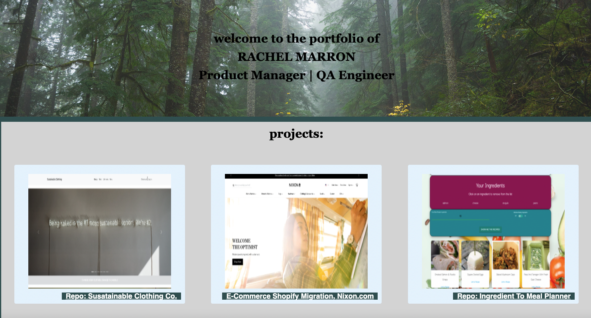

# rdmdevportfolio
Development Portfolio for Rachel Marron- Product Manager & QA Engineer

## Link to deployed application 
<a href="https://racheldmarron.github.io/rdmdevportfolio/">https://racheldmarron.github.io/rdmdevportfolio/</a>

## Overview 
** This portfolio was last updated on 03/13/2022 to showcase new projects. The portfolio also features an updated resume and LinkedIn profile. 

I created an updated version of my Portfolio in order to showcase my projects, homework assignments, and other work. I added a "resume" to the nav which leads to an external link of my resume. I also added my github and linkedin profiles, as well as updated my education/experience section to feature more recent roles. 

I also updated my GitHub account to include pinned repositories of my best work. I updated my resume to include the languages and skills I am learning in this class and updated my linked in with links to my GitHub and portfolio. 

## Summary of My Task & User Story 
This assigment had a user story of: AS AN employer, I WANT to view a potential employee's deployed portfolio of work samples, SO THAT I can review samples of their work and assess whether they're a good candidate for an open position
The Acceptance Criteria included: 
<ul><li>Portolfio contains the Developer's name, a recent photo, and links to their work, about them, and how to contact them</li>
<li>Link to resume- added to the Nav</li>
<li>Links in the navigation lead down to applicable content on site</li>
<li>Updated projects with relevant projects with external links</li>
<li>Added Github and Linkedin icons with external links to my pages</li>
<li>Portfolio should be responsive</li></ul>

## UI Of My Portfolio
<ul>
<li>Created a top navigation that changes colors when you hover over each item. Each item will lead you to the correct area on site.</li>
<li>Laid an image in the background of my title/header</li>
<li>Listed Projects I have worked on and images link out to applicable project. When you hover over the applicable project, the background changes in color to give better UX on which project the employer is viewing</li>
<li>Included Education section with details. Similarly, when employer hovers over education, the box will light up</li>
<li>I created an About Me section with a recent image of me. When the employer clicks the image, they are taken to my LinkedIn profile</li>
<li>Created a contact form where prospective employers can leave their contact information. The form has auto filled my contact information for reference.</li>
<li>Using media queries, I made the webpage responsive.</li>
  </ul>

## Publishing to GitHub
<ul>
  <li>I created a new repository on my GitHub account titled "rdmdevportfolio"</li>
  <li>I pulled the repository onto my computer and committed changes to GitHub as necessary</li>
</ul>
   

## Contributors

- N/A

## License

This application is covered under MIT License    

- - -

© 2021 Rachel Delaney Marron, Inc. All Rights Reserved.
